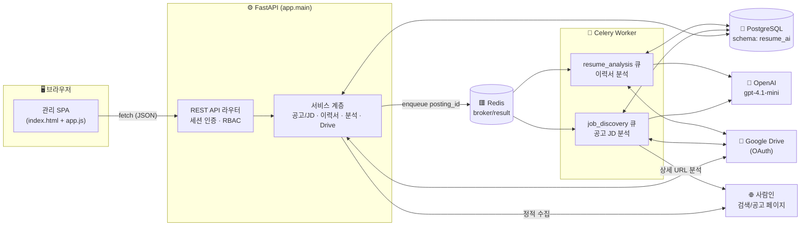
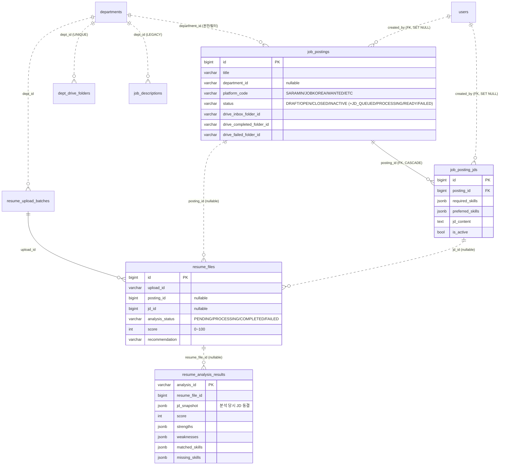
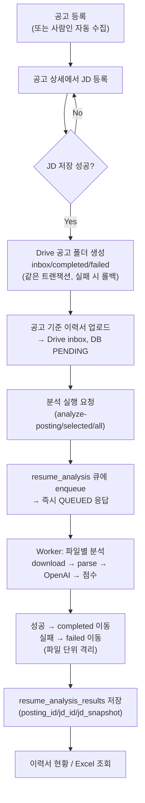
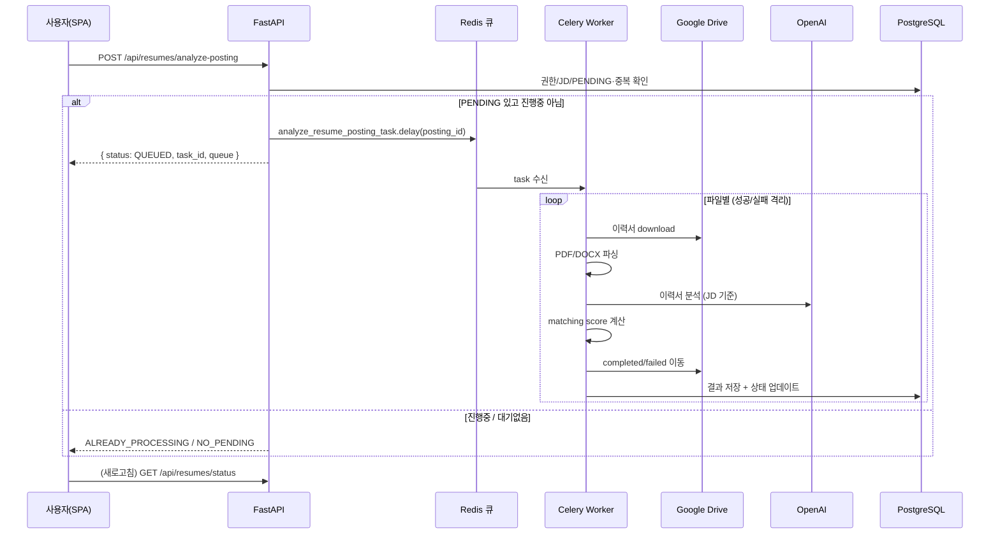
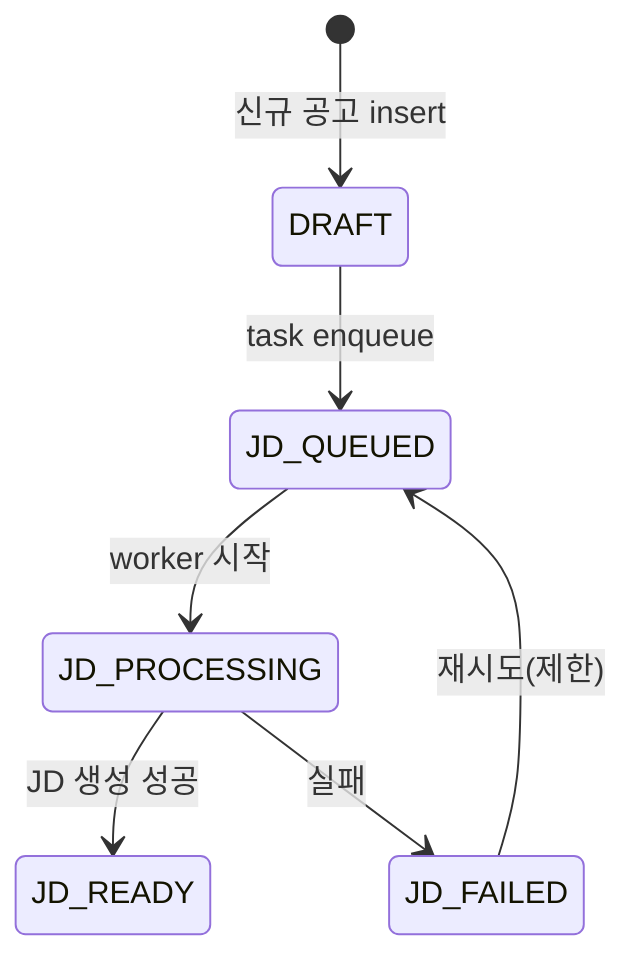
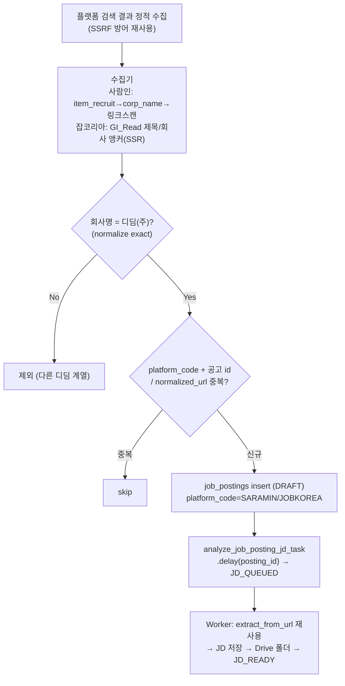
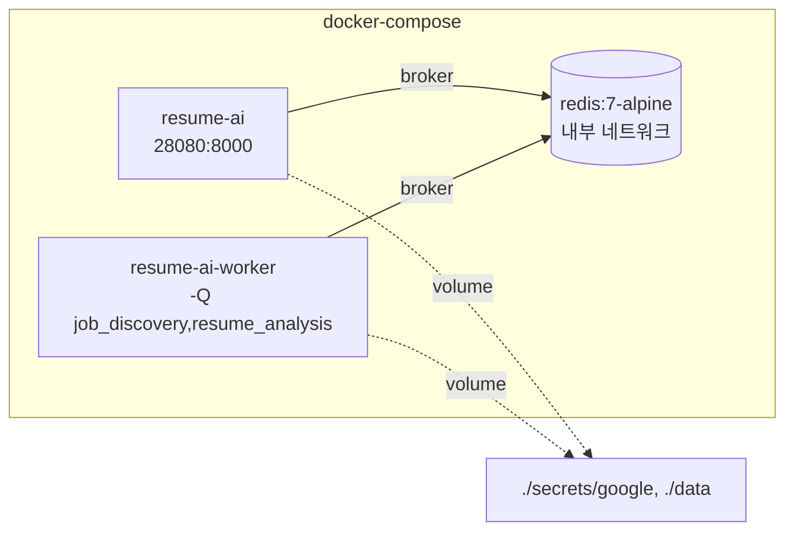

# Resume AI Analyzer

**채용 공고(job posting) 중심으로 이력서를 Google Drive에 수집하고, OpenAI로 자동 분석·점수화하여 채용 검토를 돕는 FastAPI 기반 시스템입니다.**

공고를 등록하고 공고별 JD(직무기술서)를 기준으로 이력서를 업로드하면, AI가 필수/우대 기술 매칭과 종합 판단을 수행해 점수·추천·강점/약점을 산출합니다. 사람인 신규 공고 자동 수집과 무거운 분석 작업은 Redis/Celery 비동기 큐로 처리합니다.

---

## 목차

- [1. 기술 스택](#1-기술-스택)
- [2. 핵심 개념 (공고 중심 구조)](#2-핵심-개념-공고-중심-구조)
- [3. 시스템 아키텍처](#3-시스템-아키텍처)
- [4. 데이터 모델 (ERD)](#4-데이터-모델-erd)
- [5. 업무 흐름 (순서도)](#5-업무-흐름-순서도)
- [6. 이력서 분석 점수 산출 기준](#6-이력서-분석-점수-산출-기준)
- [7. 비동기 작업 (Redis / Celery)](#7-비동기-작업-redis--celery)
- [8. 채용 플랫폼 신규 공고 자동 수집 (사람인·잡코리아)](#8-채용-플랫폼-신규-공고-자동-수집-사람인잡코리아)
- [9. 권한 (RBAC)](#9-권한-rbac)
- [10. API 요약](#10-api-요약)
- [11. 프로젝트 구조](#11-프로젝트-구조)
- [12. 환경변수](#12-환경변수)
- [13. 실행 방법](#13-실행-방법)
- [14. 배포 (Docker / NCP)](#14-배포-docker--ncp)
- [15. 보안 / SSL·CA / 트러블슈팅](#15-보안--sslca--트러블슈팅)

---

## 1. 기술 스택

| 영역 | 기술 |
| --- | --- |
| 언어 / 런타임 | Python 3.12, 패키지 관리 `uv` |
| 웹 프레임워크 | FastAPI, Uvicorn, Jinja2(SSR 셸) + Vanilla JS(SPA) |
| 데이터 | PostgreSQL (스키마 `resume_ai`), SQLAlchemy 2.x, Alembic, Pydantic v2 |
| 비동기 큐 | Redis (broker/result) + Celery (`job_discovery`, `resume_analysis` 큐) |
| AI / LLM | OpenAI **`gpt-4.1-mini`** (Responses API → Chat Completions fallback) |
| 파일 저장소 | Google Drive (OAuth) — 이력서 업로드/이동, 부서·공고 폴더 |
| 문서 파싱 | `pypdf`(PDF), `python-docx`(DOCX), `openpyxl`(Excel 내보내기) |
| 인증 | 서버 세션(서명 쿠키, JWT 아님) + `bcrypt` 비밀번호 해시 |
| 배포 | Docker / Docker Compose, NCP 서버, 사내 Fortinet Root CA 대응 |

---

## 2. 핵심 개념 (공고 중심 구조)

시스템의 채용 단위는 **공고(job_posting)** 이며, 공고에 연결된 **JD(job_posting_jd)** 를 기준으로 이력서를 등록·분석합니다. 부서/팀은 삭제하지 않고 **권한·조직·필터 기준**으로 유지합니다.

```
외부 플랫폼 공고 → 공고 등록 → 공고 상세에서 JD 등록(= Drive 폴더 자동 생성)
→ 공고 기준 이력서 업로드 → 공고 기준 분석 → 이력서 현황/Excel 조회
```

| 구분 | 설명 |
| --- | --- |
| **공고** `job_postings` | 실제 채용 단위. 외부 플랫폼(사람인/잡코리아/원티드/기타) 공고와 1:1. 부서·플랫폼·상태·Drive 폴더 보유. |
| **JD** `job_posting_jds` | 공고에 연결된 매칭 기준. **현재 1공고 = 1 active JD**(서비스 강제, 향후 N 확장 대비 테이블 분리). |
| **부서/팀** `departments` | Google Drive `dept_config.json`에서 동기화. 권한/필터 기준으로만 사용. |
| **이력서/결과** `resume_files` / `resume_analysis_results` | `posting_id`/`jd_id`로 공고/JD에 종속. |

> ⚙️ **주력 플로우 = 공고 중심**입니다. 과거 **부서 중심** 경로(`/api/jd`·`/api/uploads`·`/api/analyze`·`/api/resume`, `job_descriptions` 테이블, `batch_service`/`upload_service`)는 **레거시(하위호환용)** 로 `LEGACY` 주석만 달려 있으며 신규 개발 대상이 아닙니다.

---

## 3. 시스템 아키텍처



**핵심 원칙**
- API는 무거운 작업(공고 JD 분석·이력서 분석)을 직접 실행하지 않고 **큐에 `posting_id`만 적재**한 뒤 즉시 응답합니다. Worker가 DB에서 다시 조회해 처리합니다.
- Worker는 API와 **동일 이미지/`.env`/볼륨**을 사용해 DB·OpenAI·Google Drive·사내 CA에 동일하게 접근합니다.

---

## 4. 데이터 모델 (ERD)

모든 테이블은 PostgreSQL 스키마 `resume_ai`에 있습니다. 관계는 대부분 **soft reference**(값 참조)이며, 실제 DB FK는 공고/JD 관련 3개뿐입니다.



| 테이블 | 역할 |
| --- | --- |
| `users` | 로그인 계정 + role/부서 스코프 |
| `departments` | Drive dept_config 동기화 부서 트리 |
| `job_postings` | **채용 단위(공고)** |
| `job_posting_jds` | 공고 active JD (현행) |
| `dept_drive_folders` | 부서별 Drive 폴더 매핑 |
| `resume_upload_batches` | 업로드 1회 = 1 회차(batch) |
| `resume_files` | 분석 대상 파일 1건 = 지원자 1명 |
| `resume_analysis_results` | AI 분석 결과 상세 + JD 스냅샷 |

> 스키마는 **Alembic 마이그레이션으로 일원화**(`0001`~`0005`)되어 있습니다. 빈 DB에서 `alembic upgrade head` 한 번으로 전체 테이블/제약/인덱스가 생성됩니다. ([13. 실행 방법](#13-실행-방법) 참고)

---

## 5. 업무 흐름 (순서도)

### 5-1. 공고 → JD → 업로드 → 분석 (공식 주력 플로우)



### 5-2. 이력서 분석 비동기 시퀀스



---

## 6. 이력서 분석 점수 산출 기준

**매칭 점수 = 100점 만점** (`app/services/matching_service.py`, 산식 불변)

| 항목 | 배점 | 계산 |
| --- | --- | --- |
| 필수 기술 | **70점** | `matched_required / total_required × 70` |
| 우대 기술 | **20점** | `matched_preferred / total_preferred × 20` |
| AI 종합 판단 | **10점** | `ai_judgment_score` (0~10, LLM 산출) |

- 스킬 매칭은 **소문자+trim 후 exact set 매칭**(부분일치/유사도 없음).
- AI 분석(`ai_agent_service`)은 `candidate_summary`, `extracted_skills`, `strengths`, `weaknesses`, `recommendation`, `ai_judgment_score`를 반환합니다.

**추천 문구** (점수 구간 기반, 탈락/불합격 표현 금지)

| 점수 | 추천 문구 |
| --- | --- |
| ≥ 80 | 우선 검토 추천 |
| ≥ 60 | 추가 검토 필요 |
| < 60 | 낮은 적합도 |

> JD별 기준 점수(`threshold_score`)는 현재 참고용으로만 저장되고 추천 판단에는 미반영입니다(향후 반영 예정).

---

## 7. 비동기 작업 (Redis / Celery)

두 개의 큐로 분리되어 있습니다.

| 큐 | Task | 역할 | 트리거 |
| --- | --- | --- | --- |
| `job_discovery` | `analyze_job_posting_jd_task` | 신규 공고의 상세 URL 분석 → JD 생성/저장 → Drive 폴더 | 사람인·잡코리아 수집 배치 |
| `resume_analysis` | `analyze_resume_posting_task` | 공고 기준 이력서 분석(download/parse/OpenAI/이동/저장) | `analyze-posting/selected/all` |

**설계 원칙**
- 큐 payload는 **primitive만**(`posting_id`, `resume_file_ids`, `requested_by_user_id`) — 요청 DB 세션/ORM 객체 미전달.
- Worker는 기존 서비스(`resume_analysis_service.analyze_posting`, `job_extract_service`, `job_posting_service`)를 **재사용**(로직 복붙 없음).
- **멱등/중복 방지**: 이미 active JD가 있거나 완료 상태면 skip. 공고에 PROCESSING 파일이 있으면 `ALREADY_PROCESSING`, PENDING 없으면 `NO_PENDING`.
- **파일 단위 실패 격리**: 30개 중 1개 실패해도 나머지 계속 처리. Task 상태 = `COMPLETED` / `PARTIAL_FAILED` / `FAILED`.

**JD 분석 상태 전이** (공고 `status`, 사용자 편집용 상태와 분리)



**실행** — [13. 실행 방법](#13-실행-방법)의 Celery worker 섹션 참고.

---

## 8. 채용 플랫폼 신규 공고 자동 수집 (사람인·잡코리아)

**사람인·잡코리아** 검색 결과에서 **디딤(주)** 신규 공고를 자동으로 `job_postings`에 등록하고, JD 분석은 Celery worker가 비동기로 처리합니다. 두 플랫폼은 **같은 등록/큐 로직**(`job_posting_discovery_service._discover`)을 재사용하며, 각 수집기만 플랫폼별로 분리되어 있습니다(복붙 없음).



**지원 플랫폼 / platform_code 자동 매핑** — URL 도메인 기준(`job_extract_service.platform_code_for_url`). 수동 공고 등록/수정도 platform_code 미입력 시 URL 로 자동 채웁니다(사용자가 고른 값은 유지).

| URL 도메인 | platform_code |
| --- | --- |
| `saramin.co.kr` | `SARAMIN` |
| `jobkorea.co.kr` | `JOBKOREA` |
| 그 외(미지원/알 수 없음) | 기존 기본값(`None`) — 오류 없이 통과 |

| 특징 | 사람인 (SARAMIN) | 잡코리아 (JOBKOREA) |
| --- | --- | --- |
| 검색 렌더링 | 목록이 **JS 렌더링**(라이브 정적 수집 한계) | **서버 렌더링(SSR)** — 정적 수집 동작(라이브 12건 확인) |
| 공고 식별자 | `rec_idx` | `GI_Read/{gno}`(GI_No) |
| URL 정규화 | tracking 제거, `.../relay/view?rec_idx=NNN` | tracking 제거, `.../Recruit/GI_Read/{gno}` |
| 회사명 필터 | `디딤(주)`/`디딤 (주)`/`디딤 주식회사` exact (공용) | 동일 필터 재사용 (`디딤㈜`는 `(주)` 치환 후) |
| 수동 실행 | `POST /api/jobs/discover/saramin/didim` | `POST /api/jobs/discover/jobkorea/didim` |

- **공통**: 중복은 `platform_code` + 공고 식별자(정규화 `platform_posting_url`) 기준(별도 `external_id` 컬럼 없음). 큐에는 `detail_url`이 아니라 **`posting_id`**. 회사명 결속 없는 링크는 미등록(false positive 방지). 스케줄러 1시간 주기 코드는 있으나 **주석 처리**(startup 자동 실행 안 함).
- **dry-run**: `...?dry_run=true` → 실제 insert/큐 적재 없이 수집·중복 판단 결과(`platform_code`/`company_name`/`title`/`raw_url`/`normalized_url`/`is_duplicate`/`skip_reason`)만 반환(검증용).

> ⚠️ **사람인 실측 한계**: 사람인 검색 결과 목록은 **JS 렌더링**이라 정적 HTML에 상세 링크가 없어 라이브 정적 수집은 0건입니다(파서는 마크업 존재 시 정확히 동작). 실제 라이브 수집에는 **브라우저 렌더링 DOM fallback(Playwright/Selenium)** 이 필요합니다(후속 과제). **잡코리아는 SSR 이라 현재 정적 수집이 동작**하나, 사이트 구조 변경 시 파서 수정이 필요합니다(`parser_missed` 로그로 감지).

---

## 9. 권한 (RBAC)

세션 기반 인증(`user_id`). 프론트 숨김과 별개로 **백엔드에서 403 재검증**합니다.

| 역할 | 조회 | 공고/JD 등록·수정 | 이력서 업로드/분석 | 전체 분석 |
| --- | --- | --- | --- | --- |
| **ADMIN** | 전체 | 전체 | 전체 | ✅ (전용) |
| **MANAGER** | 본인 부서+하위 | 본인 부서+하위 | 본인 부서+하위 | ❌ |
| **VIEWER** | 본인 부서+하위 | ❌ | ❌ | ❌ |

- 부서 스코프는 `department_access_service`가 PostgreSQL **recursive CTE**로 계산.
- 사용자 관리(`/api/admin/*`)는 **ADMIN 전용**. 마지막 활성 ADMIN 강등/비활성화 차단.

---

## 10. API 요약

라우터는 인증만 담당하고, 세밀한 부서 인가는 서비스의 `ensure_*` 헬퍼가 파일 읽기·Drive·LLM 호출 **이전**에 검증합니다.

### 주력(KEEP) · 인프라(INFRA)

| 라우터 | prefix | 주요 엔드포인트 | 분류 |
| --- | --- | --- | --- |
| `auth_router` | `/api/auth` | `login`·`logout`·`me`·`me/departments`·`me/profile` | KEEP |
| `admin_users_router` | `/api/admin` | 사용자 CRUD·활성 토글·비번 초기화 (ADMIN) | KEEP |
| `job_postings_router` | `/api/job-postings` | 목록/검색/상세, `{id}/jd`(upsert+Drive), `{id}/jd/recommend` | KEEP |
| `resumes_router` | `/api/resumes` | `upload-to-drive`, `status`(+Excel), `analyze-posting/selected/all` | KEEP |
| `jobs_router` | `/api/jobs` | `extract-from-url`, `discover/saramin/didim`, `discover/jobkorea/didim` (둘 다 `?dry_run`) | KEEP |
| `drive_router` | `/api/drive` | Drive 연결/폴더 동기화, `dept-config` | INFRA |
| `departments_router` | `/api/departments` | 부서 트리, Drive→DB 동기화 | INFRA |
| `db_router` | `/api/db` | health/tables/counts | INFRA |

### 레거시(LEGACY, 하위호환 · 신규 사용 금지)

| 라우터 | prefix | 대체(신규) |
| --- | --- | --- |
| `jd_router` / `jds_router` | `/api/jd` · `/api/jds` | 공고별 `job_posting_jds` (`/api/job-postings/{id}/jd`) |
| `upload_router` | `/api/uploads` | `/api/resumes/upload-to-drive` |
| `analyze_router` / `resume_router` | `/api/analyze` · `/api/resume` | `/api/resumes/analyze-posting` |
| `dept_router` | `/api/depts` | `department_access_service` |

> Swagger UI: `http://<host>/docs`

---

## 11. 프로젝트 구조

```
resume-auto-analyzer/
├─ app/
│  ├─ main.py               # FastAPI 조립 (라우터 등록, 세션, 정적/템플릿)
│  ├─ api/                  # 라우터 (HTTP 경계, 인증)
│  ├─ services/             # 도메인 로직 (공고/JD · 이력서 · 분석 · Drive · 사람인)
│  ├─ tasks/                # Celery task (job_posting_tasks, resume_analysis_tasks)
│  ├─ core/                 # config · celery_app · security · password · paths
│  ├─ db/
│  │  ├─ base.py session.py health.py
│  │  └─ models/            # SQLAlchemy 모델 9개
│  ├─ schemas/              # Pydantic DTO
│  ├─ static/ templates/    # app.js · style.css · index.html · login.html
│  └─ data/
├─ alembic/                 # DB 마이그레이션 (0001~0005)
├─ docs/
│  ├─ WORKFLOW.md TODO.md sql/ work-log/
├─ certs/                   # 사내 Root CA (Fortinet)
├─ secrets/google/          # OAuth credentials.json / token.json (Git 제외)
├─ Dockerfile docker-compose.yml run.sh
└─ pyproject.toml uv.lock .env(.example)
```

---

## 12. 환경변수

`.env`에서 읽습니다. `.env.example`을 복사해 작성하며 **실제 키/비밀번호는 커밋하지 않습니다.**

| 변수 | 용도 |
| --- | --- |
| `SESSION_SECRET_KEY` | 세션 쿠키 서명 (운영 필수 교체) |
| `OPENAI_API_KEY` / `OPENAI_MODEL` | LLM (기본 `gpt-4.1-mini`) |
| `DB_HOST/PORT/NAME/USER/PASSWORD/SCHEMA` 또는 `DATABASE_URL` | PostgreSQL (`DATABASE_URL` 우선) |
| `GOOGLE_CREDENTIALS_PATH` / `GOOGLE_TOKEN_PATH` | Google OAuth 파일 경로 |
| `CELERY_BROKER_URL` / `CELERY_RESULT_BACKEND` | Redis (compose 내부는 `redis://redis:6379/0`) |
| `CELERY_TASK_DEFAULT_QUEUE` / `CELERY_TIMEZONE` | 큐/타임존 (`job_discovery` / `Asia/Seoul`) |
| `SSL_CERT_FILE` / `REQUESTS_CA_BUNDLE` | 사내 Root CA 번들 경로 |
| `SARAMIN_DIDIM_SEARCH_URL` / `_KEYWORD` / `_COMPANY_NAME` | 사람인 수집 설정 (미설정 시 코드 기본값) |
| `JOBKOREA_DIDIM_SEARCH_URL` / `_KEYWORD` / `_COMPANY_NAME` | 잡코리아 수집 설정 (미설정 시 코드 기본값) |

---

## 13. 실행 방법

### 사전 준비

```bash
uv sync                    # 의존성 설치
cp .env.example .env       # 값 채우기 (DB / OpenAI / Google 경로 등)
```

### DB 초기화 (Alembic)

빈 PostgreSQL DB(또는 빈 `resume_ai` 스키마)에서 **한 번**으로 전체 스키마가 생성됩니다.

```bash
uv run alembic upgrade head
uv run alembic current      # 상태 확인 → 0005 (head)
```

- 신규 환경은 수동 SQL 실행이 **불필요**합니다(`0002~0005`에 편입 완료).
- 기존 DB(수동 SQL 이미 적용)는 idempotent하게 `upgrade head` 또는 `alembic stamp head`.

### 로컬 실행 (uv)

| 순서 | 명령 |
| --- | --- |
| 1) Redis | `docker run -d --name redis -p 6379:6379 redis:7-alpine` → `redis-cli ping`(PONG) |
| 2) API | `uv run uvicorn app.main:app --reload` → http://localhost:8000 (`/docs`) |
| 3) Worker | `uv run celery -A app.core.celery_app.celery_app worker --loglevel=INFO -Q job_discovery,resume_analysis` |

로컬은 `.env`에 `CELERY_BROKER_URL=redis://localhost:6379/0`, Google 경로는 상대경로(`secrets/google/...`) 사용 가능. 최초 Drive 호출 시 터미널에 출력되는 OAuth URL로 인증하면 `token.json`이 생성됩니다.

---

## 14. 배포 (Docker / NCP)

### Docker Compose

```bash
docker compose up -d --build      # redis + resume-ai(app) + resume-ai-worker
docker compose logs -f resume-ai-worker
```



- 포트: 호스트 **`28080`** → 컨테이너 `8000` → http://서버IP:28080/docs
- app/worker는 **동일 이미지·`.env`·볼륨**(google secrets, data) 사용. redis는 기본 내부 네트워크만(host 포트 미노출).
- `.env` / `secrets` / `credentials.json` / `token.json` 은 이미지에 포함하지 않고 `env_file`/volume으로 runtime 주입(`.dockerignore` 처리).

### NCP 서버 (tar.gz + scp)

```bash
# 로컬: 압축 → scp 업로드 → 서버에서 해제 → .env/secrets/certs 배치
docker compose up -d --build
# NCP ACG(방화벽)에서 28080 인바운드 오픈
```

---

## 15. 보안 / SSL·CA / 트러블슈팅

### SSL / 사내 CA (Fortinet)

회사망 SSL inspection 대응을 위해 `certs/company-root-ca.crt`(FortiGate Root CA)를 Docker 이미지 시스템 번들에 병합(`update-ca-certificates`)하고, `SSL_CERT_FILE`/`REQUESTS_CA_BUNDLE`로 지정합니다. OpenAI 호출만 공개 CA(certifi)로 별도 처리합니다.

### Google 계정 / Token 교체

`secrets/google/credentials.json`(OAuth 클라이언트) + `token.json`(발급 토큰) 두 파일. 토큰 만료/권한 변경 시 `token.json`을 지우고 재인증(터미널 OAuth URL)하면 재발급됩니다.

### DB 연결 주의사항

⚠️ **`DATABASE_URL`이 있으면 `DB_*`보다 우선**합니다. `DATABASE_URL`에 옛 IP가 남아 있으면 `DB_HOST`를 바꿔도 그 IP로 접속을 시도하니 주의하세요.

### 보안 체크리스트

| 항목 | 권장 |
| --- | --- |
| `SESSION_SECRET_KEY` | 운영에서 안전한 랜덤 값으로 교체 |
| `.env` / 시크릿 | Git 커밋 금지, 이미지 미포함(runtime 주입) |
| 세션 쿠키 `https_only` | 운영이 HTTPS면 `True` 권장 |
| 로그 | OpenAI Key/Google token/DB 비밀번호/이력서 원문/HTML 전문 미출력 |
| 인증 없는 관리 API | `/api/drive`·`/api/db`·`/api/departments` 등 인증 적용 검토(후속) |

### 트러블슈팅

| 증상 | 확인 |
| --- | --- |
| 분석이 `QUEUED`만 되고 진행 안 됨 | Redis·Celery worker 기동 여부, `docker compose logs -f resume-ai-worker` |
| Drive 인증 실패 | `token.json` 존재/만료, 재인증 |
| DB 연결 timeout | `DATABASE_URL`/`DB_HOST`, (Docker) `host.docker.internal` |
| 사람인 수집 0건 | 검색 결과 JS 렌더링 한계(정적 수집 불가) — Playwright fallback 후속 과제 |
| 잡코리아 수집 0건 | SSR 이나 사이트 구조 변경 가능 — `parser_missed` 로그 확인 후 파서 갱신 |
| 외부 API TLS 오류 | 사내 CA 번들(`SSL_CERT_FILE`) 설정 |

---

## 참고 문서

- 업무 흐름: [`docs/WORKFLOW.md`](docs/WORKFLOW.md)
- 남은 작업: [`docs/TODO.md`](docs/TODO.md)
- 단계별 작업 기록: [`docs/work-log/`](docs/work-log/)
- DB 변경 SQL(참고용): [`docs/sql/`](docs/sql/)
- **DB 테이블 사용 현황/정리 후보**: [`docs/db-table-usage-analysis.md`](docs/db-table-usage-analysis.md)

> **DB 테이블 정리 상태**: 위 분석 문서는 **제거 후보 리스트업/근거 정리까지만**입니다. 아직 실제 `DROP TABLE`/삭제 마이그레이션은 없습니다(10개 테이블 모두 유지). `job_descriptions`·`dept_drive_folders`(레거시)는 은퇴·승인 후 별도 정리 예정.
